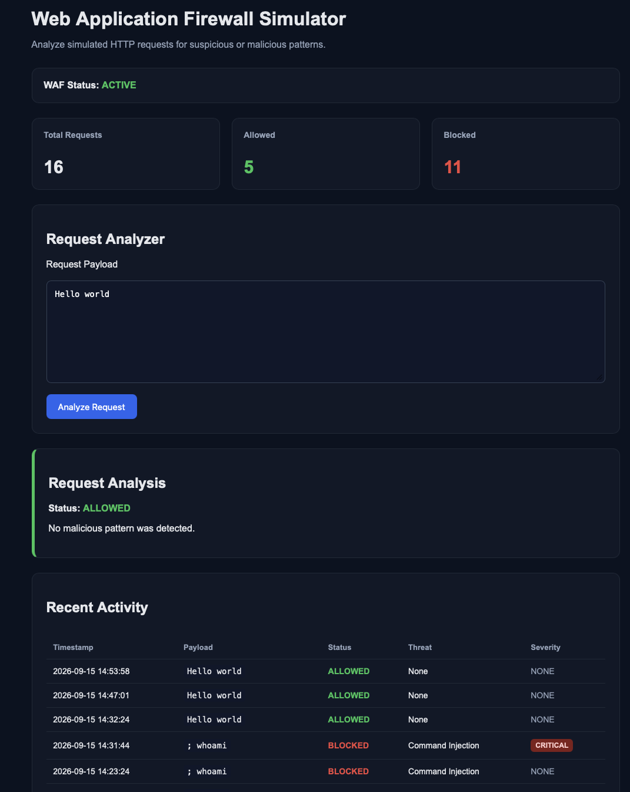

# Web Application Firewall (WAF) Simulator

A Python and Flask-based Web Application Firewall simulator that analyzes simulated HTTP request payloads and identifies potentially malicious patterns.

This project was created as a cybersecurity learning tool to demonstrate how a basic WAF can inspect requests, classify threats, assign severity levels, and log security events.

---

## Dashboard Preview



---

## Features

- Analyze simulated HTTP request payloads
- Detect common web attack patterns
- Block suspicious requests
- Allow requests that do not match known malicious patterns
- Assign severity levels to detected threats
- Explain why a request was blocked
- Track total, allowed, and blocked requests
- Maintain persistent request history using JSON logging
- Display recent activity in a cybersecurity-style dashboard

---

## Threat Detection

The simulator currently detects:

| Threat | Severity |
| --- | --- |
| SQL Injection | HIGH |
| Cross-Site Scripting (XSS) | HIGH |
| Path Traversal | MEDIUM |
| Command Injection | CRITICAL |
| Sensitive File Access | HIGH |

### Example Test Payloads

SQL Injection:

```text
' OR 1=1 --
```

Cross-Site Scripting:

```text
<script>alert('test')</script>
```

Path Traversal:

```text
../../etc/passwd
```

Command Injection:

```text
; whoami
```

---

## How It Works

```text
User submits request
        |
        v
Flask receives payload
        |
        v
WAF detection engine
        |
        v
Regex pattern matching
        |
        +------------------+
        |                  |
        v                  v
  Threat Found       No Threat Found
        |                  |
        v                  v
     BLOCKED             ALLOWED
        |
        v
Threat classification
Severity assignment
Event logging
```

The WAF detection rules are located in:

```text
waf.py
```

The Flask application and request logging functionality are located in:

```text
app.py
```

---

## Project Structure

```text
waf-simulator/
|
|-- app.py
|-- waf.py
|-- requirements.txt
|-- README.md
|-- .gitignore
|
|-- images/
|   |-- waf-dashboard.png
|
|-- templates/
|   |-- index.html
|
|-- static/
|   |-- style.css
|
|-- logs/
    |-- .gitkeep
```

Runtime JSON log files are excluded from GitHub using `.gitignore`.

---

## Technologies Used

- Python
- Flask
- HTML
- CSS
- Jinja2
- Regular Expressions
- JSON
- Git
- GitHub

---

## Installation

Clone the repository:

```bash
git clone https://github.com/Dominique601/waf-simulator.git
```

Move into the project directory:

```bash
cd waf-simulator
```

Create a virtual environment:

```bash
python3 -m venv venv
```

Activate it:

```bash
source venv/bin/activate
```

Install dependencies:

```bash
pip install -r requirements.txt
```

Run the application:

```bash
python3 app.py
```

Then open:

```text
http://127.0.0.1:5000
```

---

## Example Results

A harmless payload such as:

```text
Hello world
```

produces:

```text
Status: ALLOWED
Severity: NONE
```

A simulated command injection payload:

```text
; whoami
```

produces:

```text
Status: BLOCKED
Threat Type: Command Injection
Severity: CRITICAL
```

---

## Security Concepts Demonstrated

This project demonstrates:

- Web Application Firewall fundamentals
- HTTP request inspection
- Signature-based threat detection
- Regular-expression pattern matching
- SQL injection detection
- Cross-Site Scripting detection
- Command injection detection
- Path traversal detection
- Sensitive file access detection
- Security event logging
- Threat classification
- Severity-based alerting
- Git version control

---

## Limitations

This project is an educational simulator and is not intended to replace a production Web Application Firewall.

The current detection engine primarily uses signature-based regular expressions. Production WAF solutions may also include:

- Request normalization
- Rate limiting
- IP reputation analysis
- Bot detection
- Behavioral analysis
- OWASP Core Rule Set integration
- False-positive tuning
- TLS termination
- Real-time network traffic inspection

---

## Future Improvements

Potential future enhancements include:

- Additional attack signatures
- Broader OWASP Top 10 coverage
- HTTP method inspection
- HTTP header analysis
- IP address logging
- Detection rule IDs
- Risk scoring
- Searchable security logs
- Dashboard charts
- Log filtering
- Exportable security reports

---

## Disclaimer

This project is intended for educational and defensive cybersecurity purposes only.

Testing should only be performed against systems you own or have explicit authorization to test.
